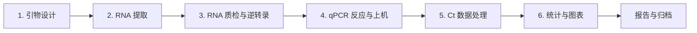

# RT-qPCR Protocol Guide

> 从引物设计、RNA 提取、逆转录、qPCR 实验到 Delta Delta Ct 数据分析的实验流程知识库。

本项目由本地 `_archive/` 学习资料整理而来，目标是把分散的实验笔记、SOP、质控标准和数据处理逻辑整理成一个适合 GitHub 阅读、复用和持续维护的项目。

## 适用场景

- RT-qPCR 实验前的流程学习和参数速查
- RNA 提取、逆转录、qPCR 上机前的 checklist
- Ct 数据整理、Delta Ct / Delta Delta Ct / fold change 分析
- 实验记录模板、样本表和 Ct 表格模板管理
- 后续开发自动化分析工具或实验室 SOP 文档库

## 项目结构

```text
rt-qpcr-protocol-guide/
├── README.md
├── UPLOAD_TO_GITHUB.md
├── .gitignore
├── docs/
│   ├── 01-primer-design.md
│   ├── 02-rna-extraction.md
│   ├── 03-reverse-transcription.md
│   ├── 04-qpcr-experiment.md
│   ├── 05-data-analysis.md
│   ├── 06-automation-pipeline.md
│   ├── troubleshooting.md
│   └── references.md
└── templates/
    ├── ct_values_template.csv
    ├── experiment_record_template.md
    ├── rna_concentration_template.csv
    └── sample_info_template.csv
```

## 完整流程



## 章节索引

| 阶段 | 文档 | 核心内容 |
|---|---|---|
| 1 | [引物设计](docs/01-primer-design.md) | Tm、GC、产物长度、跨外显子、特异性验证 |
| 2 | [RNA 提取](docs/02-rna-extraction.md) | TRIzol/Freezol 流程、NanoDrop QC、污染排查 |
| 3 | [逆转录计算](docs/03-reverse-transcription.md) | RNA 投入量、20 uL RT 体系、cDNA 保存 |
| 4 | [qPCR 实验](docs/04-qpcr-experiment.md) | 反应体系、板布局、扩增程序、质控 |
| 5 | [结果处理](docs/05-data-analysis.md) | Delta Ct、Delta Delta Ct、fold change、统计检验 |
| 6 | [自动化架构](docs/06-automation-pipeline.md) | 数据契约、批处理流程、报告输出 |
| 附录 | [故障排查](docs/troubleshooting.md) | 无扩增、多峰、NTC 有信号、重复差异大 |

## 关键质控标准

| 指标 | 推荐标准 | 异常提示 |
|---|---:|---|
| RNA A260/280 | 1.8-2.1 | 低于 1.8 可能有蛋白污染 |
| RNA A260/230 | >= 1.8，理想 >= 2.0 | 低值常见于盐、酚或有机溶剂残留 |
| 技术重复 SD | < 0.5 Ct | 移液误差、气泡、封板或模板问题 |
| NTC | Ct >= 38 或 Undetermined | Ct < 35 提示污染或引物二聚体 |
| NRT | 无扩增 | 有信号提示 gDNA 污染 |
| 扩增效率 | 90%-110% | 需优化引物、模板浓度或反应条件 |
| 熔解曲线 | 单一峰 | 多峰提示非特异扩增 |

## 数据模板

项目提供 3 个最小输入模板：

- [sample_info_template.csv](templates/sample_info_template.csv): 样本分组信息
- [rna_concentration_template.csv](templates/rna_concentration_template.csv): RNA 浓度和纯度记录
- [ct_values_template.csv](templates/ct_values_template.csv): qPCR Ct 原始数据

核心列名建议保持英文，方便后续 Python/R 自动化读取。

## 免责声明

本项目是实验学习和流程管理资料，不替代试剂盒说明书、仪器说明书、单位 SOP 或生物安全要求。实际实验参数应结合样本类型、试剂品牌、仪器型号和实验室规范确认。

