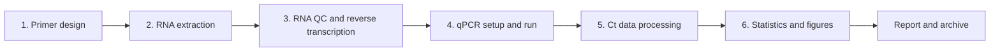

# RT-qPCR Protocol Guide

> A practical RT-qPCR workflow repository covering primer design, RNA extraction, reverse transcription, qPCR setup, and Delta Delta Ct analysis.

This project turns scattered local notes, SOP fragments, QC rules, data templates, and Python utilities into a clean GitHub repository that can be reused and maintained.

## Use Cases

- Learn and review the RT-qPCR workflow before running experiments.
- Check RNA extraction, reverse transcription, and qPCR setup requirements.
- Organize Ct data and calculate Delta Ct, Delta Delta Ct, fold change, and log2FC.
- Maintain experiment templates for sample metadata, RNA QC, Ct values, and records.
- Generate reverse-transcription reaction plans and Delta Delta Ct results with Python.
- Preserve the original `05_Result_Processing` GUI source code with sanitized example data.
- Extend the repository into a lab SOP library or automated analysis toolkit.

## Repository Layout

```text
rt-qpcr-protocol-guide/
+-- README.md
+-- UPLOAD_TO_GITHUB.md
+-- LICENSE
+-- pyproject.toml
+-- .gitignore
+-- docs/
|   +-- 01-primer-design.md
|   +-- 02-rna-extraction.md
|   +-- 03-reverse-transcription.md
|   +-- 04-qpcr-experiment.md
|   +-- 05-data-analysis.md
|   +-- 06-automation-pipeline.md
|   +-- troubleshooting.md
|   +-- references.md
+-- examples/
|   +-- run_demo.py
+-- src/
|   +-- rt_qpcr_guide/
|       +-- cli.py
|       +-- io.py
|       +-- primer_qc.py
|       +-- qpcr_analysis.py
|       +-- rt_calculator.py
+-- tests/
|   +-- test_primer_qc.py
|   +-- test_qpcr_analysis.py
|   +-- test_rt_calculator.py
+-- legacy/
|   +-- 05_Result_Processing/
|       +-- README.md
|       +-- result_processor/
|           +-- src/
|           +-- scripts/
|           +-- examples/
|           +-- configs/
|           +-- README.md
+-- templates/
    +-- ct_values_template.csv
    +-- experiment_record_template.md
    +-- rna_concentration_template.csv
    +-- sample_info_template.csv
```

## Workflow



## Documentation Index

| Stage | Document | Main topics |
|---|---|---|
| 1 | [Primer design](docs/01-primer-design.md) | Tm, GC content, amplicon length, exon junctions, specificity checks |
| 2 | [RNA extraction](docs/02-rna-extraction.md) | TRIzol workflow, NanoDrop QC, contamination checks |
| 3 | [Reverse transcription](docs/03-reverse-transcription.md) | RNA input, 20 uL RT setup, cDNA storage |
| 4 | [qPCR experiment](docs/04-qpcr-experiment.md) | Reaction setup, plate layout, cycling program, QC |
| 5 | [Data analysis](docs/05-data-analysis.md) | Delta Ct, Delta Delta Ct, fold change, statistical testing |
| 6 | [Automation pipeline](docs/06-automation-pipeline.md) | Data contracts, batch workflow, report outputs |
| Appendix | [Troubleshooting](docs/troubleshooting.md) | No amplification, multiple melt peaks, NTC signal, high replicate SD |

## Key QC Criteria

| Metric | Recommended range | Warning sign |
|---|---:|---|
| RNA A260/280 | 1.8-2.1 | Values below 1.8 may indicate protein contamination. |
| RNA A260/230 | >= 1.8, ideally >= 2.0 | Low values often indicate salt, phenol, or solvent carryover. |
| Technical replicate SD | < 0.5 Ct | High SD suggests pipetting errors, bubbles, sealing issues, or poor mixing. |
| NTC | Ct >= 38 or Undetermined | Ct < 35 suggests contamination or primer dimers. |
| NRT | No amplification | Signal suggests genomic DNA contamination. |
| Amplification efficiency | 90%-110% | Out-of-range efficiency requires primer or reaction optimization. |
| Melt curve | Single peak | Multiple peaks suggest nonspecific amplification. |

## Data Templates

This repository provides three minimal input templates:

- [sample_info_template.csv](templates/sample_info_template.csv): sample metadata and groups
- [rna_concentration_template.csv](templates/rna_concentration_template.csv): RNA concentration and purity records
- [ct_values_template.csv](templates/ct_values_template.csv): raw qPCR Ct values

Use English column names for easier Python and R automation.

## Python Toolkit

### Install

```powershell
cd rt-qpcr-protocol-guide
python -m pip install -e .
```

### Generate a Reverse-Transcription Plan

```powershell
rt-qpcr-guide rt-plan `
  --rna templates\rna_concentration_template.csv `
  --target-ng 1000 `
  --output results\demo_rt_plan.csv
```

### Run Delta Delta Ct Analysis

```powershell
rt-qpcr-guide analyze `
  --ct templates\ct_values_template.csv `
  --samples templates\sample_info_template.csv `
  --reference GAPDH `
  --control Control `
  --outdir results\demo_ddct
```

Output:

```text
results/demo_ddct/
+-- detail.csv
+-- summary.csv
```

### Run Tests

```powershell
python -m pytest tests -q
```

Current tests cover:

- RT reaction volume calculation
- Primer length, GC content, Tm, and amplicon-length QC
- Delta Ct, Delta Delta Ct, fold change, and log2FC calculations
- Summary CSV export

## Legacy GUI Project

The original result-processing GUI project is preserved at:

```text
legacy/05_Result_Processing/result_processor/
```

This folder contains Tkinter GUI source code, sanitized example data, configuration files, and launch scripts. Local virtual environments, binary executables, logs, and generated result files are intentionally excluded from the repository.

Run the GUI from source:

```powershell
cd legacy\05_Result_Processing\result_processor
python -m pip install -r requirements.txt
python scripts\start_gui.py
```

## Disclaimer

This repository is for experiment learning, workflow management, and lightweight analysis support. It does not replace kit manuals, instrument manuals, institutional SOPs, or biosafety requirements. Always verify final experimental parameters against sample type, reagent brand, instrument model, and lab policy.
