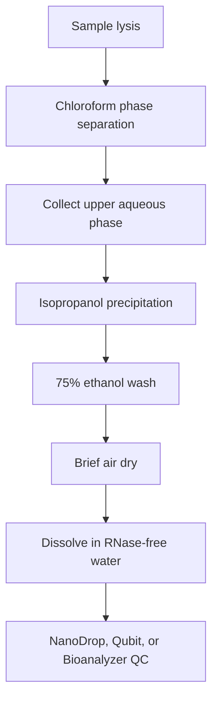

# 02. RNA Extraction

## Goal

Extract RNA with sufficient concentration, acceptable purity, and adequate integrity for stable reverse transcription and qPCR.

## Basic TRIzol Workflow

## Typical Ratios

| Step | Typical condition |
|---|---|
| Sample lysis | 1 mL TRIzol per 50-100 mg tissue |
| Phase separation | 200 uL chloroform, shake vigorously for 15 s |
| Centrifugation | 12000 g, 15 min, 4 degC |
| Precipitation | Upper aqueous phase plus equal volume isopropanol, 10 min at room temperature |
| Wash | 1 mL 75% ethanol, 7500 g, 5 min |
| Dissolution | 20-50 uL RNase-free water |

## QC Criteria

| Metric | Acceptable | Good | Notes |
|---|---:|---:|---|
| Concentration | > 50 ng/uL | > 200 ng/uL | Low concentration limits RT input. |
| A260/280 | >= 1.8 | 1.9-2.1 | Low values often indicate protein contamination. |
| A260/230 | >= 1.8 | >= 2.0 | Low values often indicate salts, phenol, or solvent carryover. |
| RIN | >= 7 | >= 8 | Requires Bioanalyzer or equivalent equipment. |

## Practical Notes

- Wear gloves and use RNase-free tubes and tips throughout the workflow.
- Process tissue quickly after collection, or snap-freeze it in liquid nitrogen.
- Avoid aspirating the interphase when collecting the aqueous phase.
- Do not over-dry the RNA pellet, because it becomes difficult to dissolve.
- Include an NRT control in downstream qPCR to detect genomic DNA carryover.
