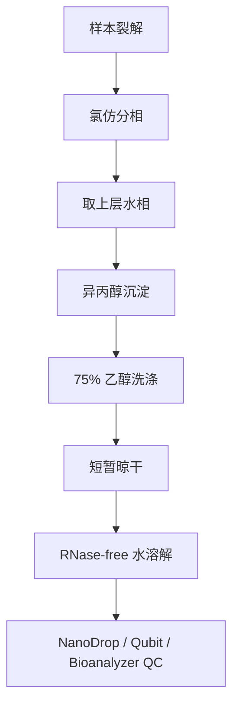

# 02. RNA Extraction

## 目标

获得浓度足够、纯度合格、完整性可接受的 RNA，为逆转录和 qPCR 提供稳定模板。

## TRIzol 基本流程

## 常用比例

| 步骤 | 典型条件 |
|---|---|
| 样本裂解 | 1 mL TRIzol / 50-100 mg 组织 |
| 分相 | 200 uL 氯仿，剧烈振荡 15 s |
| 离心 | 12000 g, 15 min, 4 degC |
| 沉淀 | 上层水相 + 等体积异丙醇，室温 10 min |
| 洗涤 | 1 mL 75% 乙醇，7500 g, 5 min |
| 溶解 | 20-50 uL RNase-free 水 |

## QC 标准

| 指标 | 合格 | 优秀 | 说明 |
|---|---:|---:|---|
| 浓度 | > 50 ng/uL | > 200 ng/uL | 低浓度会限制 RT 投入量 |
| A260/280 | >= 1.8 | 1.9-2.1 | 低值常提示蛋白污染 |
| A260/230 | >= 1.8 | >= 2.0 | 低值常提示盐、酚或有机溶剂残留 |
| RIN | >= 7 | >= 8 | 需要 Bioanalyzer 等设备 |

## 操作要点

- 全程戴手套，使用 RNase-free 管和枪头。
- 组织离体后尽快处理，无法立即提取时液氮速冻。
- 取水相时不要吸到中间蛋白层。
- RNA 沉淀不要过度晾干，否则难以重溶。
- 后续 qPCR 建议设置 NRT 对照排查 gDNA。

