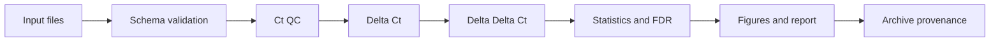

# 06. Automation Pipeline

## Goal

Combine manual Ct-table organization, QC, Delta Delta Ct calculation, statistical testing, and figure export into a reproducible analysis workflow.

## Recommended Pipeline



## Input Contracts

### `sample_info.csv`

| Column | Type | Description |
|---|---|---|
| sample_id | string | Unique sample ID |
| group | string | Group name, such as Control or Treatment |
| tissue | string | Optional tissue or cell type |
| batch | string | Optional experimental batch |

### `ct_values.csv`

| Column | Type | Description |
|---|---|---|
| sample_id | string | Matching sample ID |
| gene | string | Target gene or reference gene |
| ct | number | Ct value |
| replicate | integer | Technical replicate number |
| well | string | Optional well position |

## Suggested Output Directory

```text
results/
+-- run_YYYYMMDD_HHMMSS/
    +-- tables/
    |   +-- detail.csv
    |   +-- summary.csv
    +-- figures/
    |   +-- fold_change.png
    |   +-- volcano.png
    +-- report.md
    +-- provenance.json
```

## Automation Notes

- Record reference gene, control group, statistical method, and outlier method explicitly.
- Store input and output paths as relative paths for portability.
- Generate a unique run ID for each analysis run.
- Preserve the raw Ct table and never overwrite the source file.
- Generate tables and figures from the same cleaned dataset to avoid inconsistencies.
