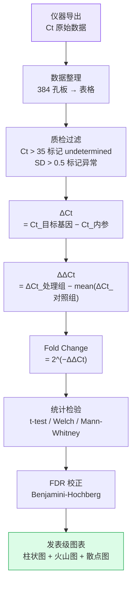

# Stage 5: 结果处理与 ΔΔCt 分析



---

## 本阶段内容

| 文件 | 说明 |
|------|------|
| `结果处理/README.md` | qPCR 结果处理器 Pro 使用说明 |
| `结果处理/src/complete_gui.py` | Tkinter GUI（~1590 行）：Roche LightCycler 384 孔板解析、格式转换、ΔΔCt 计算、批量导出 |
| `结果处理/configs/export_formats.yaml` | 导出格式定义 |
| `结果处理/20250111F1-♂-male-hmc-3...csv` | 实际分析结果示例 |
| `结果处理/exe版本/` | 打包的 .exe 独立版本 |

## ΔΔCt 计算公式

```
1. ΔCt(样本, 基因) = mean(Ct_目标基因) − mean(Ct_内参基因)

2. ΔΔCt(样本, 基因) = ΔCt(样本) − mean(ΔCt(所有对照组样本))

3. Fold Change = 2^(−ΔΔCt)

4. log2FC = −ΔΔCt
```

## 显著性判定

| 标记 | FDR 范围 | 含义 |
|------|----------|------|
| `***` | < 0.001 | 极显著 |
| `**` | < 0.01 | 高度显著 |
| `*` | < 0.05 | 显著 |
| `ns` | ≥ 0.05 | 不显著 |

## 离群值处理

| 方法 | 适用场景 | 原理 |
|------|----------|------|
| Grubbs 检验 | 小样本 (n ≤ 6) | 检验最大偏差值是否显著 |
| IQR 法 | 大样本 | Q1−1.5×IQR ~ Q3+1.5×IQR |
| Z-Score | 正态分布 | \|z\| > 2 判为离群 |

## 实际数据示例

来自 `20250111F1-♂-male-hmc-3...csv`：

| Sample | Gene | Ct | ΔCt | ΔΔCt | 2^-ΔΔCt |
|--------|------|----|-----|------|---------|
| Control_1 | GAPDH | 18.5 | — | — | — |
| Control_1 | Camk2a | 24.2 | 5.7 | 0 | 1.0 |
| Treatment_1 | Camk2a | 22.1 | 3.8 | -1.9 | 3.73 |
