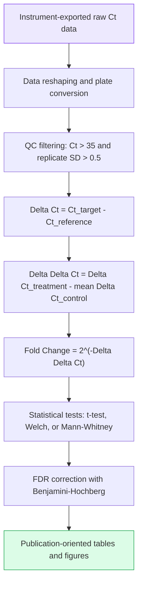

# Stage 5: Result Processing and Delta Delta Ct Analysis



## Contents

| Path | Description |
|---|---|
| `result_processor/README.md` | User guide for the qPCR Result Processor Pro GUI |
| `result_processor/src/complete_gui.py` | Tkinter GUI for plate parsing, format conversion, Delta Delta Ct analysis, and batch export |
| `result_processor/src/ixo_parser.py` | Roche LightCycler 480 `.ixo` parser |
| `result_processor/src/plate_converter.py` | Plate conversion helpers |
| `result_processor/configs/export_formats.yaml` | Export format configuration |
| `result_processor/examples/sample_ddct_input.csv` | Sanitized Delta Delta Ct example input |

## Delta Delta Ct Formula

```text
1. Delta Ct(sample, gene) = mean(Ct_target_gene) - mean(Ct_reference_gene)

2. Delta Delta Ct(sample, gene) = Delta Ct(sample) - mean(Delta Ct(control samples))

3. Fold Change = 2^(-Delta Delta Ct)

4. log2FC = -Delta Delta Ct
```

## Significance Labels

| Label | FDR range | Meaning |
|---|---:|---|
| `***` | < 0.001 | Very significant |
| `**` | < 0.01 | Highly significant |
| `*` | < 0.05 | Significant |
| `ns` | >= 0.05 | Not significant |

## Outlier Handling

| Method | Use case | Principle |
|---|---|---|
| Grubbs test | Small sample size, usually n <= 6 | Tests whether the largest deviation is significant. |
| IQR rule | Larger sample sets | Values outside Q1 - 1.5 IQR and Q3 + 1.5 IQR are flagged. |
| Z-score | Approximately normal data | Absolute z-score > 2 is flagged as an outlier. |

## Sanitized Example

Example source: `result_processor/examples/sample_ddct_input.csv`

| Sample | Gene | Ct | Delta Ct | Delta Delta Ct | 2^(-Delta Delta Ct) |
|---|---|---:|---:|---:|---:|
| Control_1 | GAPDH | 18.5 | - | - | - |
| Control_1 | GeneA | 24.2 | 5.7 | 0 | 1.0 |
| Treatment_1 | GeneA | 22.1 | 3.8 | -1.9 | 3.73 |
